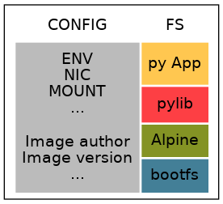
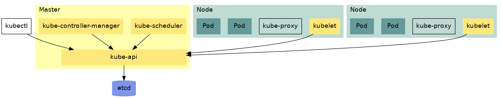
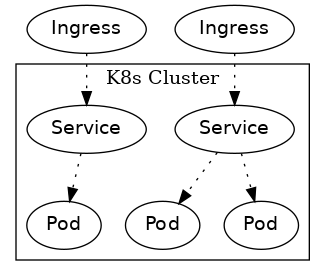

.. Header levels:
   L1 L2 L3 L4 L5 L6
   == -- ~~ "" '' ``


.. contents:: **Contents**
   :backlinks: none
   :depth: 3

.. sectnum:: :depth: 3


Stay sharp
==========
A list of resources to stay up to date in the rapidly developing world of Kubernetes:

* https://kubernetes.io/blog/
* https://www.cncf.io/newsroom/
* https://kubedex.com/
* https://www.infoq.com/Kubernetes/news
* https://learnk8s.io/blog

Organizations
=============
.. _Definition CNCF: https://github.com/cncf/toc/blob/master/DEFINITION.md
.. _OCI git: https://github.com/opencontainers
.. _OCI image spec: https://github.com/opencontainers/image-spec/
.. _OCI runtime spec: https://github.com/opencontainers/runtime-spec/

CNCF_
-----

[`Definition <Definition CNCF_>`_] - Cloud Native Computing Foundation

[`Landscape <https://l.cncf.io>`_] - A map of cloud native technology and their implementations

OCI
---
[`git <OCI git_>`_] - Open Container Initiative: Specifies standards to drive interoperability of container technologies
    * `Image specification <OCI image spec_>`_
    * `Runtime specification <OCI runtime spec_>`_

Containerization
================
.. _container terminology red hat: https://developers.redhat.com/blog/2018/02/22/container-terminology-practical-introduction/#h.def2e0bag2rr
.. _man cgroups: http://man7.org/linux/man-pages/man7/cgroups.7.html
.. _man namespaces: http://man7.org/linux/man-pages/man7/namespaces.7.html
.. _read namespaces NET: https://blog.yadutaf.fr/2014/01/19/introduction-to-linux-namespaces-part-5-net/
.. _read namespaces PID: https://blog.yadutaf.fr/2014/01/05/introduction-to-linux-namespaces-part-3-pid/
.. _read namespaces MNT: https://blog.yadutaf.fr/2014/01/12/introduction-to-linux-namespaces-part-4-ns-fs/
.. _read namespaces UTS: https://blog.yadutaf.fr/2013/12/22/introduction-to-linux-namespaces-part-1-uts/
.. _read namespaces IPC: https://blog.yadutaf.fr/2013/12/28/introduction-to-linux-namespaces-part-2-ipc/
.. _wikipedia OS-level virtualization: https://en.wikipedia.org/wiki/Operating-system-level_virtualization
.. _wikipedia Hardware virtualization: https://en.wikipedia.org/wiki/Hardware_virtualization
.. _wikipedia cgroups: https://en.wikipedia.org/wiki/Cgroups
.. _wikipedia linux namespaces: https://en.wikipedia.org/wiki/Linux_namespaces

Reads: `Container Terminology {Red Hat} <container terminology red hat_>`_

* Containerization is `OS-level virtualization <wikipedia OS-level virtualization_>`_
    * vs `Hardware virtualization <wikipedia Hardware virtualization_>`_: Using a hypervisor isolated virtual machines are created. Multiple guest OSs, each running their own kernel, can be installed on these isolated machines. Containers on the other hand are created on the already running OS and utilize kernel features for isolation.

    +-------------------------------------------+------------------------------------+
    | Container                                 | VM                                 |
    +===========================================+====================================+
    | .. image:: ./graphics/stack_container.png | .. image:: ./graphics/stack_vm.png |
    +-------------------------------------------+------------------------------------+
* Linux kernel features used for (and partly developed for the purpose of) containers [`read <https://jvns.ca/blog/2016/10/10/what-even-is-a-container/>`_, `watch <https://www.youtube.com/watch?v=sK5i-N34im8>`_]:
    * `cgroups <wikipedia cgroups_>`_ [`man <man cgroups_>`_]: Assigns and limits resources to a collection of processes
        * CPU
        * Memory
        * Disk I/O
        * Network
    * `namespaces <wikipedia linux namespaces_>`_ [`man <man namespaces_>`_]: Provides isolation and grouping in
        * NET [`read <read namespaces NET_>`_]: network devices, ip addresses/routing tables, ports
        * PID [`read <read namespaces PID_>`_]: isolated process tree
        * MNT [`read <read namespaces MNT_>`_]
        * UTS (UNIX Timesharing System) [`read <read namespaces UTS_>`_]: host/domain name
        * IPC (InterProcess Communication) [`read <read namespaces IPC_>`_]
        * USER: user isolation

Motivation
----------
* Shift away from monolithic applications to decoupled microservices
    * application consists of multiple microservice components
    * multiple environments are required
    * Managing the multiplicity becomes increasingly difficult
    * monolithic legacy applications can also be containerized
* Cloud infrastructure
    * Containers are highly portable and easily scalable
* Pros & Cons:
    * `+` Isolated environment for app to run in
        * independent of local environment configurations and installed libraries
        * easy rollback (no host OS system dependencies require downgrade, as the previous app artefact/image contains all required dependencies)
    * `+` Portability (on-premise, cloud)
    * `+` Scalability (Microservices)
        * more lightweight (compute resources, space) than virtual machines
        * easy and rapid deployment
    * `-` Security?
        * shared kernel
        * sufficient isolation?
    * Reads: `medium <https://medium.com/flow-ci/introduction-to-containers-concept-pros-and-cons-orchestration-docker-and-other-alternatives-9a2f1b61132c>`_

Best practices
--------------
.. _google best practices container operation statelessness: https://cloud.google.com/solutions/best-practices-for-operating-containers#statelessness
.. _google best practices container operation immutability: https://cloud.google.com/solutions/best-practices-for-operating-containers#immutability
.. _google best practices container operation logging: https://cloud.google.com/solutions/best-practices-for-operating-containers#use_the_native_logging_mechanisms_of_container

* `Best practices Container operation (Google) <https://cloud.google.com/solutions/best-practices-for-operating-containers>`_
* `Best practices Container building (Google) <https://cloud.google.com/solutions/best-practices-for-building-containers>`_
* `Best Practices Containerization (Atomic Project) <http://docs.projectatomic.io/container-best-practices/>`_
* `12-factor App Development <https://12factor.net/>`_

* Stateless [`Google <google best practices container operation statelessness_>`_]
    * containers keep no state, which allows them to be torn down and rebooted at any time
    * "service state" is stored externally (Redis, memcached)
* Immutable [`Google <google best practices container operation immutability_>`_]
    * containers are immutable: no updates, patches or config changes are performed on a running container
    * -> deployments are safer and reproducible
    * updates/patches are applied with a newly built image (new image version)
    * config is provisioned from external sources (e.g. Kubernetes ConfigMaps/Secrets -> ENV or conf file mounted into container)
        * configuration is deployment-specific!
* Logging to stdout/stderr [`Google <google best practices container operation logging_>`_]
    * developers need not implement advanced logging mechanisms
    * standard way to retrieve logs from containers

Images
------
`OCI Spec <https://github.com/opencontainers/image-spec/blob/master/config.md>`_

* An image consists of a file system and metadata such as image author and the container configuration (environment variables, volumes, commands to execute, ...)
* The filesystem consists of layers
    * Layers are immutable once created
    * -> Images/Containers can share layers/images
* Union/layer-based file systems enable mounting all layers (other approaches exist)
    * Editing filesystem in the thin container layer will perform a Copy-On-Write (CoW)
    * Copy-On-Write operations can impact performance if image is large
    * various `storage drivers <https://docs.docker.com/storage/storagedriver/select-storage-driver/>`_ are available
* Running an image adds a thin, writable container layer


    alt: Image architecture

Formats
~~~~~~~
* Dockerfile_ - Layers are represented by instructions
    * The way to define container images in Docker world

  .. code:: Dockerfile

       FROM ubuntu:12.04
       ADD ./mysql-setup.sh /tmp/mysql-setup.sh
       RUN /bin/sh /tmp/mysql-setup.sh             # Creates layer
       CMD ["/usr/sbin/mysqld"]                    # Execute when image is run

* CLI (e.g. buildah_, `docker commit`)

  .. code:: bash

        $ containerid=$(buildah from scratch)              # create working container from scratch
        $ buildah copy $containerid ./myscript.sh /        # copy script into container's root
        $ buildah config --cmd /myscript.sh $containerid   # execute script when running container
        $ buildah unmount $containerid
        $ buildah commit $containerid myimage              # create image


Build Tools
~~~~~~~~~~~
* buildah_ [`git <git buildah_>`_] - (Dockerfile, cli) {[Containers], ?[ProjectAtomic]?}
* kaniko_ (Dockerfile) {Google/Kubernetes} -
    * vs docker daemon: requires no root user access
* `jib <https://github.com/GoogleContainerTools/jib>`_ {Google} - building Java container images
* `Image Rebase <https://github.com/google/image-rebase>`_ {Google} - Tool to "exchange" lower layers of an image (experimental)

Registry
~~~~~~~~
* repository for images
* image version control
* image signing

Tools
"""""
* skopeo_ {Containers_, ?ProjectAtomic_?} - Interaction with image registries
    * `inspect`\ ing image (info and layers) without downloading it
    * `copy` image from one registry to another
    * supports various registries (Docker, OCI, Atomic, ...)

Hosts & registry software
"""""""""""""""""""""""""
* Private
    * Harbor_ {CNCF_, previously VMWare}
        * extends *Docker Distribution* (Docker registry software)
        * multi-tenant image signing & validation
        * security/vulnerability analysis
        * image replication among instances
        * RBAC
        * LDAP/AD support
        * Image replication between instances
    * `Docker Distribution <https://github.com/docker/distribution>`_
    * `Portus <http://port.us.org/>`_ {SUSE Linux}
        * authorization service and frontend for Docker Registry
    * `GitLab container registry <https://docs.gitlab.com/ee/user/project/container_registry.html>`_
        * Docker Registry integrated with GitLab
* Hosted
    * `Docker Hub <https://hub.docker.com/>`_ {Docker} - Public
    * `Red Hat Container Catalog <https://access.redhat.com/containers/>`_ - Public, "enterprise-grade", "secure, certified, and up-to-date"
    * `Quay <https://quay.io/>`_ {CoreOS}
    * `Google Container Registry <https://cloud.google.com/container-registry/>`_ {Google}
    * `Treescale <https://treescale.com/>`_ - Private
    * ...
* Read:
    * https://www.objectif-libre.com/en/blog/2018/08/02/self-hosted-docker-registries-showdown/

Runtime & interfaces
--------------------
* read:
    * Container Runtimes:
        `Part 1 <https://www.ianlewis.org/en/container-runtimes-part-1-introduction-container-r>`_,
        `Part 2 <https://www.ianlewis.org/en/container-runtimes-part-2-anatomy-low-level-contai>`_,
        `Part 3 <https://www.ianlewis.org/en/container-runtimes-part-3-high-level-runtimes>`_
    * `History of low-level Linux container runtimes <https://opensource.com/article/18/1/history-low-level-container-runtimes>`_

Container runtime is an overloaded term and may be discerned into low-level and high-level tools:

* low-level
    * setting up namespaces, cgroups, networking, ...
    * launch container
* high-level
    * pulling an image from registry
    * set up storage
    * merging layer file systems
    * applying a thin container layer

`CRI <https://kubernetes.io/blog/2016/12/container-runtime-interface-cri-in-kubernetes/>`_ {Google} - API was introduced to abstract away the container runtime

Tools & Runtimes
~~~~~~~~~~~~~~~~
Some only implement low-level features for running containers, others also implement image management, registry interactions, APIs and more

* rkt_ {Red Hat, previously CoreOS} -
    * now a CNCF_ incubator project
    * supported by K8s
    * github repo does not seem very active at the moment (focus lies more on CRI-O? OpenShift...)
* CRI-O_ {?ProjectAtomic_?} - Container Runtime Interface - OCI compliant
    * Optimized for Kubernetes
    * can generally use any OCI-copmliant container runtime (defaults to runc_)
* containerd_  (uses runc_)
    * contains a `CRI plugin <https://github.com/containerd/cri>`_ which allows usage with k8s
    * originates from Docker [`Source <https://medium.com/@alenkacz/whats-the-difference-between-runc-containerd-docker-3fc8f79d4d6e>`__]
* runc_ - low-level OCI_ container runtime implementation reference
* `lxc <https://en.wikipedia.org/wiki/LXC>`_ - Linux Containers (used by docker before runc existed)
* Podman_ [`git <https://github.com/containers/libpod>`_] {Containers_, ?ProjectAtomic_?} -
* katacontainers_ - VM-style containers?
* frakti_ - CRI_
* `CloudFoundryGarden <https://github.com/cloudfoundry/garden>`_

Docker
------
* Docker made containerization popular. OS-level virtualization is not new however: `FreeBSD jail <https://en.wikipedia.org/wiki/FreeBSD_jail>`_ was introduced in 2000.
* Docker integrates all image and container tools [`Source <https://www.ianlewis.org/en/container-runtimes-part-1-introduction-container-r>`_]
    * A container image format
    * A method for building container images (Dockerfile/docker build)
    * A way to manage container images (docker images, docker rm , etc.)
    * A way to manage instances of containers (docker ps, docker rm , etc.)
    * A way to share container images (docker push/pull)
    * A way to run containers (docker run) (uses runc_ [`Source <https://medium.com/cri-o/container-runtimes-clarity-342b62172dc3>`__])
* multi-stage building => specifically select artifacts from previous stages to include into container image
* distroless image => even smaller container images (https://aboullaite.me/docker-distroless-image/)
* Running an image adds the container layer (Thin Read/Write layer)
    * Writing to pre-existing data of lower layers (image layers) forces copy-on-write: Overhead can be significant!
    * Writing to container layer should be avoided as it is slow
        * For improved I/O operations use docker volumes (--mount)
        * or tmpfs if non-persistent (and/or sensitive) data (memory storage)
* Docker is great for quick and easy setup of development environments

OS
--
Container host OSs require only a few tools. Making them lightweight increases scalability.

* CoreOS
* RHEL Atomic Host [`Differences RHEL Server to Atomic Host <https://access.redhat.com/articles/2772861>`_]
    * `SPC <https://access.redhat.com/documentation/en-us/red_hat_enterprise_linux_atomic_host/7/html-single/managing_containers/index#running_super_privileged_containers>`_ (Super Priviledged Containers)
        * Atomic Host is a lean environment missing lots of tools (no rpm/yum)
        * SPC containers can be used to interface with the host to run diagnostics, monitor or manage the host OS
* RancherOS
* Photon {vmware}
* Mesosphere DC/OS (in conjunction with Mesos and Marathon)

Security
--------
Reads: `Twistlock <https://www.twistlock.com/2018/08/30/container-image-registry-security-best-practices/>`__

* CVE/vulnerability scan of images
    * [CoreOS's Clair](https://github.com/coreos/clair), `Banyon Collector <https://github.com/banyanops/collector>`_ for static analysis of vulnerabilities in containers
    * ... `other open-source tools <https://opensource.com/article/18/8/tools-container-security>`_
    * ... `and even more <https://techbeacon.com/10-top-open-source-tools-docker-security>`_
    * `Red Hat Container Catalog <https://access.redhat.com/containers/>`_ registry uses a 'Health Index'
* Audit images for age and outdated packages
* `Distroless images <https://learnk8s.io/blog/smaller-docker-images>`_ expose no binaries for an attacker to run in the container (not even a shell)
* [Red Hat: Container Security](https://www.redhat.com/en/topics/security/container-security)
    * tag images by dev/test/val/prod
    * registry automation such as checking signatures, code scans, ...)
* [Red Hat: Ten layers of container security](https://www.redhat.com/cms/managed-files/cl-container-security-openshift-cloud-devops-tech-detail-f7530kc-201705-en.pdf)
    * run containers as user, not as root
    * run process in container as user (lowered priviledges)
    * from point 6 onwards: OpenShift is "advertised"

Solutions
~~~~~~~~~
* `Tenable Container Security <https://www.tenable.com/products/tenable-io/container-security>`_
* `Twistlock <https://www.twistlock.com>`__
* `Aqua <https://www.aquasec.com/>`_
* `Stackrox <https://www.stackrox.com/>`_
* `Aporeto <https://www.aporeto.com/>`_

Organisation
------------
* Different departments/teams may be responsible for layers of an image (e.g. Operations for base image)

References
----------
* https://www.redhat.com/en/topics/containers/whats-a-linux-container


Container Orchestration
=======================
- Useful?
    - http://www.confd.io/ : Kubernetes already runs etcd

Motivation
----------
* Managing multiple containers
* Managing services, what node/machine is my service running on?
* Automatic scaling of a service
* Deployment management, i.e. deploying a new version of a service
* Failure recovery
    * replacing containers from a broken node
    * supervising container health


`Red Hat: Ten Layers of Container Security - 6. Container orchestration <https://www.redhat.com/cms/managed-files/cl-container-security-openshift-cloud-devops-tech-detail-f7530kc-201705-en.pdf>`__ :
"When managing container deployment at scale, you need to consider:

* Which containers should be deployed to which hosts.
* Which host has more capacity.
* Which containers need access to each other. How will they discover each other?
* How you control access to — and management of — shared resources, like network and storage.
* How you monitor container health.
* How you automatically scale application capacity to meet demand.
* How to enable developer self-service while also meeting security requirements."

Orchestration tools
-------------------
* Kubernetes_
* Docker Swarm
* Mesos/Marathon ?, Mesosphere?
* Nomad ?

Deployments
-----------
Deploying new versions of software

- Rolling/Canary update - increase number of pods running the new version, if errors occur -> remove new pods..
- Blue-green deployment: Start up cluster with new version, as soon as enough replicas (pods) online -> switch load-balancer to serve new version
    - may be easier to avoid inter-version application issues
    - work better when number of replicas is small
    - https://bitbucket.org/amdatulabs/amdatu-kubernetes-deployer

Management
----------

Infrastructure as Code (IAC)

Config
~~~~~~

* ??? Packer, Salt(Stack) (Cloud)
* **Ansible** - Configure and manage inventory with playbooks (roles -> playbooks -> tasks -> modules)
        * client-only architecture
        * Ansible Galaxy: Hub for sharing roles
        * only client required (runs over ssh)
* **Puppet** - config, deployment, ...
    * client/server architecture *  Requires supporting infrastructure (master nodes, dbs)
    * Periodically checks if servers/inventory are still in desired state
    * r10k?
* **Terraform** - Infrastructure **orchestration**
    * client-only architecture
    * manages infrastructure on **cloud provider platforms**
    * not easily deployed on-premise
* **Chef**
    * client/server architecture
* ? Packer.io, Saltstack, Confd
* https://www.upguard.com/articles/the-7-configuration-management-tools-you-need-to-know
* `GitOps <https://www.weave.works/blog/gitops-operations-by-pull-request>`_ (use git for continuous deployment, see also `Configuration Monitoring`_)
    * ??? Repo Structure, 1 repo/cluster?
        * ? How to integrate e.g. Helm?
        * /
            * k8s
                * deployments
                * services
                * ...?
            * ansible
            * ...
    * `Flux <https://github.com/weaveworks/flux>`_ - automated CI/CD from git repository (app code -> image -> cluster & config 'code' -> cluster)
        * `Example usage <https://github.com/stefanprodan/gitops-helm/blob/master/README.md>`_
    * Self:
        * Save PR number when changing config with kubectl: kubectl annotate, kubectl apply --record ?
    * Use Helm?? Could use cluster architecture templates, and populate different values for different cluster instances?

Package
~~~~~~~
* Helm_

Operator
~~~~~~~~
`Operator Pattern <https://coreos.com/operators/>`_: Use Custom Resource Definitions and Controllers to establish operators within Kubernetes

* https://www.operatorhub.io/

Service Mesh
~~~~~~~~~~~~
Monitor, manage and control services.

A service mesh typically consists of a *control plane* and a *data plane*. The *data plane* is usually comprised of sidecar proxies deployed next to the service or application.

* Read: https://thenewstack.io/which-service-mesh-should-i-use/
* Istio_
    * Uses Envoy_ as data plane proxies
* Linkerd_ [CNCF_ incubated]
    * *Conduit* joined with Linkerd
    * Uses custom proxy solution
    * Said to be less complicated than Istio_
* Envoy_ - Communication mesh. L7 proxy and communication bus, runs on each node.

Logging & Monitoring
--------------------

Definitions
~~~~~~~~~~~
**Black-box monitoring**
    Testing externally visible behavior as a user would see it [[SRE_C6]].
**White-box monitoring**
    Monitoring based on metrics exposed by the internals of the system, including logs, interfaces like the Java Virtual Machine Profiling Interface, or an HTTP handler that emits internal statistics [[SRE_C6]]
**Log rotation**
    In case of logging into files (vs to stderr/stdout) log file sizes should be monitored and eventually archived to prevent storage saturation. ([`logrotate`](https://manpages.debian.org/jessie/logrotate/logrotate.8.en.html))

* Logs should be written to stdout/stderr in the container
  (Otherwise: use *"sidecar"* container)
* GKE uses `fluentd <https://github.com/GoogleCloudPlatform/k8s-stackdriver/tree/master/fluentd-gcp-image>`_ (vs Logstash?)

Monitoring
~~~~~~~~~~
* Prometheus_ (Data Aggregation of *Metrics*)
    * Setup1
        * InfluxDB (storage backend)
        * Grafana (Visualization)
    * Setup2
        * ELK (E:storage, L: logging, K:visualization)
    * Icinga: Query data from Prometheus?...
    * Icinga vs Prometheus:
        * Icinga = server/software health via scripts, ...
        * Prometheus = time series of metrics fetched via http
    * JMX (Java Management Extensions): Exporter exists
* `Veneur <https://github.com/stripe/veneur>`_ & `Veneur-Prometheus <https://github.com/stripe/veneur/tree/master/cmd/veneur-prometheus>`_ & `StatsD <https://github.com/etsy/statsd>`_
* `Google Stackdriver <https://cloud.google.com/monitoring/kubernetes-engine/>`_
    * `kube-state-metrics <https://github.com/kubernetes/kube-state-metrics>`_: K8s add-on agent to generate and expose cluster-level metrics
* Cluster visualisation??

Log Aggregation
~~~~~~~~~~~~~~~
* Fluentd_
    * Also popular in ELK stack: EFK

Configuration Monitoring
~~~~~~~~~~~~~~~~~~~~~~~~
* `kubediff <https://github.com/weaveworks/kubediff>`_ - check difference in k8s config to a git repo (IAC monitoring)
    * or `kubectl diff`
    * also ansiblediff and terradiff...


Development
-----------
Kubernetes opens a wide array of new opportunities for app development.

In-cluster building
~~~~~~~~~~~~~~~~~~~
.. _jenkinsx: https://jenkins.io/projects/jenkins-x/
.. _ksync: https://github.com/vapor-ware/ksync

Instead of building source code on a developer's local machine, the source code can be synchronized to a container/pod in the cluster and built there.

* `Jenkins X <jenkinsx_>`_ utilizes this approach
    * ksync_ - synchronizes source code to a k8s pod


Kubernetes
----------

`API <k8s_api_>`__

Git Docs: [`Architecture <https://github.com/kubernetes/community/blob/master/contributors/design-proposals/architecture/architecture.md>`_] [`API conventions <https://github.com/kubernetes/community/blob/master/contributors/devel/sig-architecture/api-conventions.md>`_]

* `Trail towards K8s <https://raw.githubusercontent.com/cncf/landscape/master/trail_map/CNCF_TrailMap_latest.png>`_
* `Certified K8s-conform software <https://www.cncf.io/certification/software-conformance/>`_

>read:
>* `Benefits of Kubernetes <https://medium.com/platformer-blog/benefits-of-kubernetes-e6d5de39bc48>`_

* Highly customizable
* Pluggability (many components of the Kubernetes space are replaceable)
* Self-healing: K8s constantly supervises the cluster and drives it towards a desired state
    * Declarative configuration: The desired state is described rather than configured step by step
* Supported by lots of PaaS -> Cloud Providers

Definitions
~~~~~~~~~~~
CLI Tools
    * kubectl_ [`api <https://kubernetes.io/docs/reference/generated/kubectl/kubectl-commands>`_]
    * kubeadm_
      Kubernetes administration (Initialising master node and joining nodes)
Kubelet
    Node agent running on each node
Ingress
    external load balancer, access to kubernetes services/pods from outside
"`Sidecar <https://docs.microsoft.com/en-us/azure/architecture/patterns/sidecar>`_" container
    Container in a pod that augments pod functionalities (e.g. metric exposure for `Logging & Monitoring`_ , connection handling, ...)
etcd
    Stores the cluster state. Several etcd nodes (replication!) should be running reliably to guarantee cluster running properly!
Helm & Kustomize & Kapitan
    K8s application deployment management
high-availability cluster
    A cluster with more than one master node or implementing other means to ensure resilience

Architecture
~~~~~~~~~~~~
* API-Server talks to etcd (stores cluster desired state - yaml files)




master / control plane
""""""""""""""""""""""

etcd
''''
* Persistent storage for Kubernetes' state

kube-apiserver
''''''''''''''
* API to access cluster configuration (stored in etcd)
* accessible by kubectl, REST
* `Service Acount <https://kubernetes.io/docs/reference/access-authn-authz/service-accounts-admin/>`_ are accounts for processes/pods in the cluster to access the api server

kube-controller-manager
'''''''''''''''''''''''
* reads desired cluster state from API-Server and makes necessary adjustments
* stands for various controllers such as replication controller, namespace controller, ...
    * custom controllers can be implemented here

`kube-scheduler <https://kubernetes.io/docs/reference/command-line-tools-reference/kube-scheduler/>`_
'''''''''''''''''''''''''''''''''''''''''''''''''''''''''''''''''''''''''''''''''''''''''''''''''''''
* schedules pod creation and destruction to nodes according to rules and specifications such as resource requirements, affinity, ...

Node
""""
* worker machine - VM or physical machine
* runs pods and contains their required services

kubelet
'''''''
Agent running on nodes. Ensures Pods are running and are healthy according to assigned PodSpecs.

kube-proxy
''''''''''
Maintains network rules on the node via iptables. Monitors services and endpoints.

Pod
"""
.. _k8s pod liveness and readiness probes: https://kubernetes.io/docs/tasks/configure-pod-container/configure-liveness-readiness-probes

*  Group of one or more containers (e.g. Docker), share network(IP(same localhost), port space)/storage, can use standard IPC
* Pod IP Addresses -> inter-pod communication

* `Secrets <https://kubernetes.io/docs/concepts/configuration/secret/>`_ and `ConfigMaps <https://kubernetes.io/docs/tasks/configure-pod-container/configure-pod-configmap/>`_
    - Secrets are stored in etcd
        - etcd replicas' communication among each other is not encrypted!
* `Readiness & Liveness Probes <k8s pod liveness and readiness probes_>`_:
    * Readiness: Test when pod can accept trafic.
    * Liveness: Is pod healthy? Otherwise restart!
    * Probes can be realized via HTTP requests or cmd executions
* Graceful termination https://cloud.google.com/blog/products/gcp/kubernetes-best-practices-terminating-with-grace
    * Pod "terminating" (no more traffic routed to it) -> preStop Hook (special cmd or http request) -> SIGTERM
      -> termination grace period (default: 30s) -> SIGKILL to Pod
* **Container**
    * **Container signing**: E.g. allow specific nodes to pull only signed containers
        - Multiple signings? E.g. from DevTest/CI, Validation and Verification? -> only then allow a node in prod system to pull the image?
    * Sync time of containers with NTP!
    * Do not run container processes as root user (security vulneratibilty)!
        * [PodSecurityPolicy] - Pods that don't follow these policies are not allowed to start
        * Test container functionality with `docker run --user $((RANDOM+1)) [YOUR_CONTAINER]`
    * Pin down image versions. Eventually only down to minor updates to allow patch updates to come through automatically.
    * `Init Containers <https://kubernetes.io/docs/concepts/workloads/pods/init-containers/>`_ -
      Sequentially run (must succeed) before actual container runs


`Service <k8s_Service_>`_
"""""""""""""""""""""""""

.. _NodePort: k8s_Service_NodePort_
.. _LoadBalancer: k8s_Service_LoadBalancer_
.. _ExternalName: k8s_Service_ExternalName_

Services use virtual IPs. kube-proxy sets up the routing so access to the virtual ClusterIP is routed towards an endpoint.
A DNS record will be created for a service, allowing access via the service name (<service>.<namespace> or <service>.<namespace>.svc.cluster.local).

Different proxy modes are available for routing Services (https://kubernetes.io/docs/concepts/services-networking/service/#virtual-ips-and-service-proxies).

`Types <https://kubernetes.io/docs/concepts/services-networking/service/#publishing-services-service-types>`_
'''''''''''''''''''''''''''''''''''''''''''''''''''''''''''''''''''''''''''''''''''''''''''''''''''''''''''''
* ClusterIP: Expose service endpoints (pods running the service) via a virtual cluster-internal IP.
* NodePort_: Expose service on every node IP at static port (<NodeIP>:<NodePort>)
* LoadBalancer_: Expose service externally using a cloud provider's load balancer.
* ExternalName_: Offer services to the cluster which are outside the cluster

Access to *ClusterIP* is forwarded to (by default) a random Service endpoint.
Both NodePort_ and LoadBalancer_ make use of the ClusterIP and therefore are routed once more to a random endpoint.

Security
''''''''
* Configure `Security Context <https://kubernetes.io/docs/tasks/configure-pod-container/security-context/>`_ for pods


`Ingress <k8s_Ingress_>`_
"""""""""""""""""""""""""
"Exposes HTTP(S) routes from outside the cluster to services within the cluster."
- L7 Load balancing, TLS termination, name-based virtual hosting



Compared to a Service, Ingress is a resource decoupled from the application dependent Service.
Further, a service of type LoadBalancer_ would create a loadbalancer for every service.

`Ingress controllers <k8s_Ingress_IngressController_>`_
'''''''''''''''''''''''''''''''''''''''''''''''''''''''
Ingress controllers implement Ingress API resources in the targetted platform (F5 LB, nginx, ...).
Multiple ingress controllers may exist in a cluster; an Ingress rule can specify which to use (https://github.com/kubernetes/ingress-gce/blob/master/examples/PREREQUISITES.md#ingress-class).
There are several Ingress controllers available:
* F5 BIG-IP Controller (https://clouddocs.f5.com/containers/v2/kubernetes/)

Resources
'''''''''
* https://youtu.be/Syw2PzRudIM

`Namespaces <https://kubernetes.io/docs/concepts/overview/working-with-objects/namespaces/>`_
"""""""""""""""""""""""""""""""""""""""""""""""""""""""""""""""""""""""""""""""""""""""""""""
* Namespaces are like virtual clusters within K8s which are logically isolated from each other.
* Service names can be reused multiple times in different namespaces (cross-access via domain name <service>.<namespace>)
* Use cases:
    * separate prod/dev environment
    * separate teams (theme-related work)

* Read:
    * https://kubernetes.io/blog/2016/08/kubernetes-namespaces-use-cases-insights/
        * Namespaces do not isolate resources
        * There are no security enforcement options between namespaces

`Resource Quota <https://kubernetes.io/docs/concepts/policy/resource-quotas/>`_
'''''''''''''''''''''''''''''''''''''''''''''''''''''''''''''''''''''''''''''''
* Limit resources (pods, services, compute resources, ...) per namespace

PKI
"""
* A cluster can have its own root CA. It is also possible to use one root CA for several clusters:
    * https://jvns.ca/blog/2017/08/05/how-kubernetes-certificates-work/
* `Node TLS bootstrapping <https://kubernetes.io/docs/reference/command-line-tools-reference/kubelet-tls-bootstrapping/>`_


Networking
~~~~~~~~~~
`Networking model <https://kubernetes.io/docs/concepts/cluster-administration/networking/#kubernetes-model>`_

> #### Definitions
> * iptables: linux kernel programm to manipulate network data packages
> CNI - Container Network Interface - Interface for easy addition and removal of pods to a pod network (used by kubelet)
> [`SPEC <https://github.com/containernetworking/cni/blob/master/SPEC.md#overview-1>`_]

* all containers can communicate with all other containers
* all nodes can communicate with all containers (and vice-versa)
* the IP that a container sees itself as is the same IP that others see it as
* No NAT (vs Docker)
* Every node is assigned a CIDR block for pod IPs

IP Address allocation
"""""""""""""""""""""
Private IP Addresses: https://tools.ietf.org/html/rfc1918
https://cloud.google.com/kubernetes-engine/docs/how-to/flexible-pod-cidr

Pod network
"""""""""""
Pod to Pod on same Node
'''''''''''''''''''''''
via Linux Bridge

Pod to Pod on another Node
''''''''''''''''''''''''''
* Manual router configuration: Update to route Pod IPs to correct Node
* Overlay network: Create a virtual network utilizing tools like iptables

IPv6
""""
* https://github.com/leblancd/kube-v6
* https://opsnotice.xyz/kubernetes-ipv6-only/

CNI Plugins
"""""""""""
CNI plugins offer various methods of establishing connectivity between pods.

Benchmark: https://itnext.io/benchmark-results-of-kubernetes-network-plugins-cni-over-10gbit-s-network-36475925a560

* Calico_
   - L3 Networking via iptables
   - routes are synced between hosts via BGP
   - calicoctl: allows you to achieve advanced policies and networking from a simple, command-line interface.
   - orchestrator plugins: provide close integration and synchronization with a variety of popular orchestrators.
   - key/value store: holds Calico’s policy and network configuration state.
   - calico/node: runs on each host, reads relevant policy and network configuration information from the key/value store, and implements it in the Linux kernel.
   - Dikastes/Envoy: optional Kubernetes sidecars that secure workload-to-workload communications with mutual TLS authentication and enforce application layer policy.
* kube-router_ {DigitalOcean?}
   * BGP, ipvs, ... ???
   * is it still an overlay?...
* flannel_
    * L2 VXLan
* Weave
* Open vSwitch (used by OpenShift)
    * "more mature but also complicated way to build an overlay network. This is endorsed by several of the “Big Shops” for networking." [[Source](https://kubernetes.io/docs/concepts/cluster-administration/networking/#openvswitch)]
* Multus: Allows connecting multiple network interfaces to a Pod https://github.com/intel/multus-cni

Routing
"""""""
See also `Ingress`.

https://www.getambassador.io/ : Gateway


DNS
"""
.. _ExternalDNS: https://github.com/kubernetes-incubator/external-dns

[`Concept <https://kubernetes.io/docs/concepts/services-networking/dns-pod-service/>`_]

Kubernetes control plane sets up a DNS server. Every pod created will use this for name resolution. This way, services can be resolved.

Tools
'''''
* CoreDNS_ {CNCF_} - with k8s v1.13 default DNS service (replacing kube-dns)
* ExternalDNS_ -
* `SkyDNS <https://github.com/skynetservices/skydns>`_


Security
""""""""
* `Network policy <k8s_Network_Policy_>`_ : Restrict network traffic between pods/nodes
    * Default deny policy


Resources
"""""""""
* https://youtu.be/OaXWwBLqugk
* https://youtu.be/0Omvgd7Hg1I


Storage
~~~~~~~
.. _CSI Spec: https://github.com/container-storage-interface/spec
.. _CSI Doc: https://kubernetes-csi.github.io/docs/

`Volume Types <https://kubernetes.io/docs/concepts/storage/volumes/#types-of-volumes>`_

* CSI [`Spec <CSI Spec_>`_] [`Doc <CSI Doc_>`_] - Container Storage Interface

Security
~~~~~~~~
* CIS Benchmark Kubernetes https://downloads.cisecurity.org
    * Advice on how to configure and run K8s
* https://thenewstack.io/4-major-tenets-kubernetes-security/
* Authentication -> Authorization -> [Admission Control](https://kubernetes.io/docs/reference/access-authn-authz/admission-controllers/#what-does-each-admission-controller-do)

Tools
"""""
* aquasecurity/kube-bench
* kube-hunter (penTest)
* micro-scanner

Authentication
""""""""""""""
`Doc <https://kubernetes.io/docs/reference/access-authn-authz/authentication/>`__

* Basic Auth
* X.509 client certs
* bearer tokens

OpenIDConnect
'''''''''''''
Plugins/Helpers
```````````````
:code:`kubectl` does not itself fetch the tokens from the IdP (Identity Provider). Helper utilities can be used to automatically set up the kubectl config file:

   + https://github.com/int128/kubelogin
   + https://github.com/Nordstrom/kubelogin
     + utilizes a backend server in the cluster to communicate with the IdP and hand back the token to the CLI tool
   + https://github.com/negz/kuberos (unmaintained)


Resources
`````````

* OIDC explained: https://developer.okta.com/blog/2017/07/25/oidc-primer-part-1
* `Experience Report <https://medium.com/@mrbobbytables/kubernetes-day-2-operations-authn-authz-with-oidc-and-a-little-help-from-keycloak-de4ea1bdbbe>`_

Authorization
"""""""""""""


Cluster Deployment
~~~~~~~~~~~~~~~~~~
Tools
"""""
* Kubespray (Ansible)
    * `Install Guide <https://kubernetes.io/docs/setup/custom-cloud/kubespray/>`_
    * `NetChecker <https://github.com/kubernetes-incubator/kubespray/blob/master/docs/netcheck.md>`_ - check pod connectivity
* kubeadm
* `kops <https://github.com/kubernetes/kops>`_ - kubectl on a cluster scale (i.e. managing clusters). Mostly for cloud providers?
* `Typhoon <https://github.com/poseidon/typhoon>`_ (Terraform)
* `TARMAK <https://github.com/jetstack/tarmak>`_ (Puppet & Terraform)

`Federation <k8s_federation_>`__ of Clusters
~~~~~~~~~~~~~~~~~~~~~~~~~~~~~~~~~~~~~~~~~~~~
* Allows domain access routed to multiple backends in different clusters
* Still an immature feature!

Extending products
~~~~~~~~~~~~~~~~~~
(Kubernetes Management Platform)

Rancher
"""""""

Platform9
"""""""""

Openshift
"""""""""
- Before K8s existed, OpenShift used their own platform

* vs Kubernetes: https://cloudowski.com/articles/10-differences-between-openshift-and-kubernetes/
    - OKD: Free, open-source version with all OpenShift Features (without support) https://www.okd.io/
    - must use RHEL for OpenShift, or CentOS for OKD

(- me: Beschränkung der Möglichkeiten. K8s und Container-Welt bauen auf Interoperabilität und Kompatibilität untereinander auf -> daraus folgt eine wahnsinnige Freiheit an Auswahl. Mit der Wahl OpenShift grenzt man sich unter Umständen ein)

* CloudForms : monitor health of containers in registry, prevent deployment of vulnerable containers, ...

Nirmata
"""""""


References
""""""""""
* https://blog.aquasec.com/kubernetes-management-platform-for-the-enterprise

Experience Reports
~~~~~~~~~~~~~~~~~~
* `Lessons learned - One year using Kubernetes in Production <https://techbeacon.com/one-year-using-kubernetes-production-lessons-learned>`_
* `Best practices K8s <https://www.weave.works/blog/kubernetes-best-practices>`_

ToDo:
* `Best practices Kubernetes (Google) <https://www.google.com/search?q=site%3Acloudplatform.googleblog.com%20%22kubernetes%20best%20practices%22>`_


ProjectAtomic
=============
* Red Hat project: SIG to design immutable OS -> immutable infrastructure*
* Available as RHEL Atomic OS distro!(?)
* `CoreOS <https://coreos.fedoraproject.org/>`_ replaces Atomic Host?


Interesting
===========
- Docker/Infrakit
- "Hardware virtualization disaster recovery"
- `Spinnaker <https://www.spinnaker.io>`_ - multi-cloud continuous delivery platform for deployment management
- `Cockpit <https://cockpit-project.org/>`_ - Makes hosts and containers visible
- `K8s the hard way <https://github.com/kelseyhightower/kubernetes-the-hard-way/blob/master/docs/03-compute-resources.md>`_


.. ======================
   = Links & References =
   ======================

.. ------------------------
   Projects & Organizations
   ------------------------

.. _Containers: https://github.com/containers
.. _CNCF: https://www.cncf.io
.. _ProjectAtomic: http://www.projectatomic.io

.. ----------------
   Containerization
   ----------------

.. _OCI: https://www.opencontainers.org/

.. ------------------------------------
   Image build/registry tools & formats
   ------------------------------------

.. _buildah: https://buildah.io/
.. _git buildah: https://github.com/containers/buildah
.. _Dockerfile: https://docs.docker.com/engine/reference/builder/
.. _Harbor: https://goharbor.io/
.. _kaniko: https://github.com/GoogleContainerTools/kaniko
.. _skopeo: https://github.com/containers/skopeo

.. -------------------------------
   Container runtime  & interfaces
   -------------------------------

.. _containerd: https://containerd.io/
.. _CRI-O: http://cri-o.io/
.. _frakti: https://github.com/kubernetes/frakti
.. _katacontainers: https://katacontainers.io/
.. _Podman: https://podman.io/
.. _rkt: https://github.com/rkt/rkt/
.. _runc: https://github.com/opencontainers/runc

.. --------------------
   Logging & Monitoring
   --------------------

.. _Fluentd: https://www.fluentd.org
.. _Prometheus: https://prometheus.io

.. -----------
   K8s Networking
   -----------

.. _calico: https://www.projectcalico.org/
.. _coredns: https://coredns.io/
.. _flannel: https://coreos.com/flannel/docs/latest/
.. _git flannel: https://github.com/coreos/flannel
.. _kuber-router: https://www.kube-router.io/

.. -----------------------
   Service Mesh & Proxying
   -----------------------

.. _Envoy: https://www.envoyproxy.io/
.. _Istio: https://istio.io
.. _Linkerd: https://linkerd.io

.. ----------
   Kubernetes
   ----------


.. _k8s_api: https://kubernetes.io/docs/reference/generated/kubernetes-api/v1.13

.. _Platform9: https://platform9.com/
.. _Rancher: https://rancher.com/

.. _k8s_Service: https://kubernetes.io/docs/concepts/services-networking/service/
.. _k8s_Service_NodePort: https://kubernetes.io/docs/concepts/services-networking/service/#nodeport
.. _k8s_Service_LoadBalancer: https://kubernetes.io/docs/concepts/services-networking/service/#loadbalancer
.. _k8s_Service_ExternalName: https://kubernetes.io/docs/concepts/services-networking/service/#externalname

.. _k8s_Ingress: https://kubernetes.io/docs/concepts/services-networking/ingress
.. _k8s_Ingress_IngressController: https://kubernetes.io/docs/concepts/services-networking/ingress/#ingress-controllers

.. _k8s_federation: https://kubernetes.io/docs/concepts/cluster-administration/federation/

.. _k8s_Network_Policy: https://kubernetes.io/docs/concepts/services-networking/network-policies/

.. Command Tools
   -------------

.. _kubeadm: https://kubernetes.io/docs/reference/setup-tools/kubeadm/kubeadm/
.. _kubectl: https://kubernetes.io/docs/reference/kubectl/overview/

-- _Helm: https://helm.sh/
